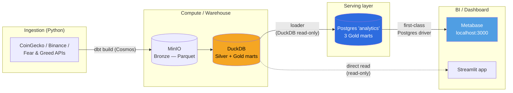
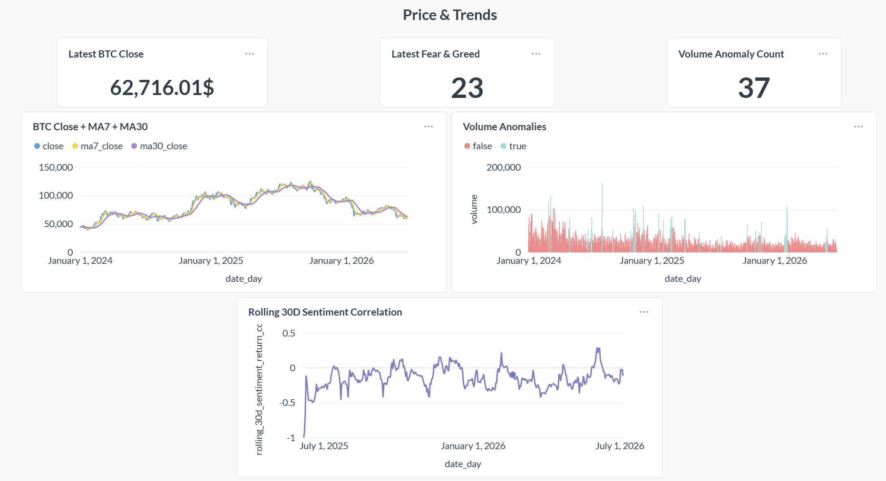
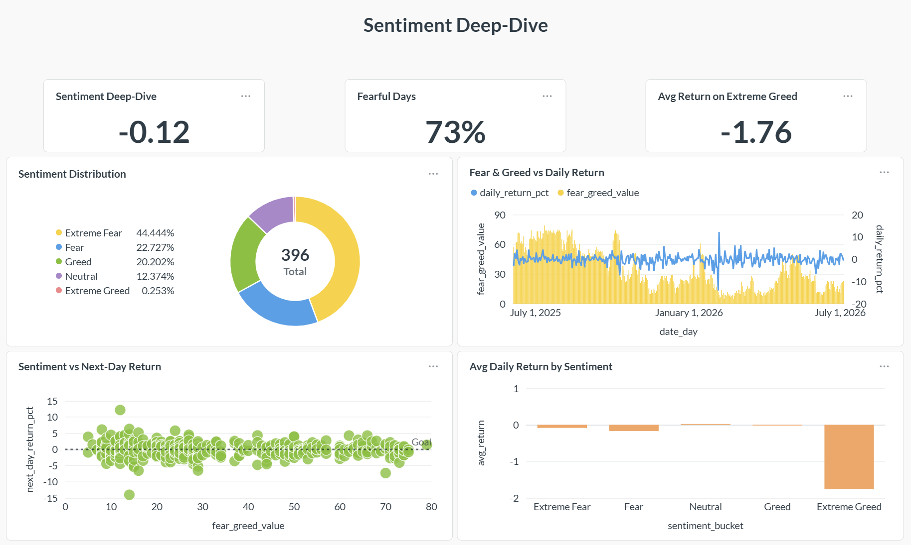

# Bitcoin Market Intelligence Pipeline

[](https://github.com/myuyen0304/Bitcoin-Market-Intelligence-Pipeline/actions/workflows/ci.yml)


[](https://myuyen0304.github.io/Bitcoin-Market-Intelligence-Pipeline/)

End-to-end **data engineering pipeline** for Bitcoin market data: orchestrated
multi-source ingestion, a Medallion (Bronze/Silver/Gold) warehouse, data quality
tests, pipeline observability, and a separated serving layer for BI.

```text
CoinGecko / Binance / Fear & Greed
        -> Bronze Parquet (Hive-partitioned, on MinIO/S3 or local disk)
        -> dbt + DuckDB  ->  Silver -> Gold marts
        -> Postgres serving layer  ->  Metabase BI
   orchestrated end-to-end by Airflow (Cosmos renders dbt per-model)
```

Local-first by design: the whole stack runs on Docker Compose with **MinIO** as an
S3-compatible object store, so it exercises a real cloud-shaped data path at zero
cost. AWS/Terraform and Kafka streaming are roadmap items.

## Architecture

Compute (DuckDB) is deliberately separated from the serving layer (Postgres): the BI
tool reads a Postgres serving database populated from DuckDB, so it never locks the
warehouse and uses a first-class Postgres driver instead of a fragile community DuckDB one.



## Orchestration & Reliability

The whole pipeline runs as one Airflow DAG (`btc_daily_ingestion`), scheduled daily
at 08:30 Asia/Ho_Chi_Minh:

```text
ingest_coingecko  ─┐
ingest_binance    ─┼── validate_bronze ── dbt_build (Cosmos: task per model + test)
ingest_fear_greed ─┘
```

Engineering decisions that make it production-shaped, not a toy:

- **Cosmos renders dbt into per-model Airflow tasks** — each model/test is its own
  task with independent retry and lineage in the Airflow graph, instead of one opaque
  `dbt build` shell command.
- **Idempotent runs** — tasks filter source data to `logical_date`, `catchup=False`,
  and `max_active_runs=1`, so re-running a date never double-writes.
- **Retry policy** — ingestion uses exponential backoff; dbt tasks use a short fixed
  retry tuned for transient object-store cold-cache misses.
- **Single-writer safety** — DuckDB allows one writer; all dbt tasks are pinned to a
  1-slot `duckdb_serial` pool so parallel staging models can't deadlock on the file.
- **Config-driven storage** — `S3_ENDPOINT_URL` switches Bronze between MinIO/S3 and
  local disk with no code change; the DAG stays agnostic to where Bronze lands.

**Backfill case study:** a 27-day June gap appeared because incremental ingestion only
pulls recent days. It was repaired by re-running the full-history bronze loader
(`start=2024-01-01`) → `dbt run` → serving-layer loader, restoring a continuous
2024-01-01 → 2026-07-05 series (917 rows, 0 gaps) — the kind of gap-detection and
backfill work that data pipelines need in practice.

## Data Quality & Observability

Two layers of checks, shifted to where they catch problems earliest:

- **Great Expectations gate on Bronze *input*** (`bitcoin_pipeline/quality/`): the DAG's
  `validate_bronze` task runs an expectation suite per source against the raw Parquet it
  just wrote — row count ≥ 1, not-null keys, `price_usd`/OHLC strictly positive,
  `high ≥ low`, `fear_greed_value` in 0–100, `sentiment_bucket` in the known set. A
  failure stops the run before dbt transforms bad data. Suites are defined as code and
  the run refreshes HTML **Data Docs** (observability for input data).
- **45 dbt tests on Silver/Gold *output*** as code in `schema.yml`: not-null keys,
  accepted values (Binance intervals), Fear & Greed range 0–100, positive price /
  non-negative volume, grain uniqueness.
- **Elementary** (dbt observability, v0.25) is installed as a dbt package for
  data anomaly monitoring and run artifacts on top of the standard tests.

> Great Expectations validates the **input** (Bronze, before transform); dbt tests
> validate the **output** (Silver/Gold, after transform).

Run the tests:

```powershell
dbt test
```

## Medallion Model (dbt + DuckDB)

```text
staging/       Bronze -> Silver: typed, deduped to grain (stg_*.sql)
intermediate/  daily enrichment joins across the 3 sources
marts/         Gold business marts:
               - mart_btc_price_analysis        (MA7/MA30, volatility)
               - mart_btc_sentiment_correlation (rolling 30d corr, next-day return)
               - mart_btc_volume_anomalies      (volume z-score, anomaly flag)
```

All business logic lives in the marts, not in the BI tool — Metabase only SELECTs
pre-computed columns. Models and columns are documented in `schema.yml`.

**Live dbt docs + lineage graph** (auto-published to GitHub Pages):
<https://myuyen0304.github.io/Bitcoin-Market-Intelligence-Pipeline/>

## CI/CD

GitHub Actions runs on every push/PR to `main` — deterministic checks only (no live
API calls, which are flaky/geo-blocked on CI runners):

- `ruff` lint + `compileall` syntax check
- `dbt deps` + `dbt parse` to validate models and refs

## Serving Layer & Dashboard

A **Postgres serving database** is loaded from the DuckDB Gold marts, and Metabase
reads from Postgres — so BI never touches the compute warehouse. The Metabase
dashboard has two tabs; it is the pipeline's last mile, proof the marts are usable.

**Price & Trends** — KPI cards, BTC close vs MA7/MA30, and volume anomalies.



**Sentiment Deep-Dive** — Fear & Greed vs daily return, sentiment distribution, and rolling 30-day correlation.



## Repository Map

```text
bitcoin_pipeline/
  ingestion/               Python API fetchers (BaseFetcher) and shared utilities
  dags/                    Airflow daily DAG (Cosmos dbt task group)
  data/bronze/             Local Hive-partitioned Bronze Parquet outputs
  dbt/models/staging/      Silver cleanup models
  dbt/models/intermediate/ Daily enrichment joins
  dbt/models/marts/        Gold business marts
  dbt/models/schema.yml    Model/column docs + data-quality tests
  dashboard/app.py         Streamlit dashboard reading Gold marts only
  tests/                   API smoke tests
docker-compose.yml            local dashboard
docker-compose.airflow.yml    Airflow (LocalExecutor + Postgres) + MinIO
docker-compose.metabase.yml   Metabase + Postgres serving layer
```

## Quickstart

Use Python 3.11+.

```powershell
python -m venv .venv
.\.venv\Scripts\python.exe -m pip install -r requirements.txt
Copy-Item .env.example .env
$env:DBT_PROFILES_DIR=(Get-Location).Path
```

Run the pipeline by hand (ingest -> transform -> dashboard):

```powershell
.\.venv\Scripts\python.exe bitcoin_pipeline\run_local_bronze_ingestion.py
dbt run
dbt test
streamlit run bitcoin_pipeline/dashboard/app.py   # http://localhost:8501
```

## Run The Full Stack On Airflow (Docker)

Run the whole DAG — 3 parallel ingestions -> Bronze validation -> `dbt build` (per
model) — on a local Airflow with MinIO standing in for S3:

```powershell
docker compose -f docker-compose.airflow.yml build
docker compose -f docker-compose.airflow.yml up airflow-init   # one-off: metadata DB + admin user
docker compose -f docker-compose.airflow.yml up -d
```

- Airflow UI: `http://localhost:8080` (login `admin` / `admin`) — enable and trigger
  `btc_daily_ingestion`.
- MinIO console: `http://localhost:9001` (login `minioadmin` / `minioadmin`).

When run this way the pipeline writes Bronze to MinIO and dbt reads it back over S3
(`httpfs`), exercising a real object-store path. dbt runs in an isolated venv inside
the image so its deps never conflict with Airflow's. Tear down with
`docker compose -f docker-compose.airflow.yml down`.

## Output Contract

```text
Bronze:  bitcoin_pipeline/data/bronze/{source}/{dataset}/year=YYYY/month=MM/day=DD/
DuckDB:  bitcoin_pipeline/data/bitcoin_pipeline.duckdb
Serving: Postgres 'analytics' — 3 Gold marts, read by Metabase
```

## Roadmap

- Incremental dbt marts (`materialized='incremental'`, `merge`) to prove idempotency at the transform layer
- Real cloud deploy (Terraform + AWS S3/Athena) replacing MinIO/DuckDB
- Kafka streaming ingestion for intraday data
- Reverse-ETL alerting (Slack) on volume anomalies

## Environment Variables

| Variable | Purpose | Default |
|---|---|---|
| `DATA_DIR` | Local data root for Bronze Parquet | `bitcoin_pipeline/data` |
| `DUCKDB_PATH` | DuckDB database file path | `bitcoin_pipeline/data/bitcoin_pipeline.duckdb` |
| `S3_BUCKET` | Bronze bucket name on MinIO/S3 | `bitcoin-pipeline-bronze` |
| `AWS_REGION` | AWS/MinIO region | `ap-southeast-1` |
| `S3_ENDPOINT_URL` | MinIO/S3 endpoint; **empty = write/read Bronze on local disk** | empty |
| `AWS_ACCESS_KEY_ID` | MinIO/S3 access key (required when endpoint is set) | empty |
| `AWS_SECRET_ACCESS_KEY` | MinIO/S3 secret key (required when endpoint is set) | empty |
| `DBT_TARGET` | dbt profile target: `dev` (local Bronze) or `minio` (S3 Bronze) | `dev` |
